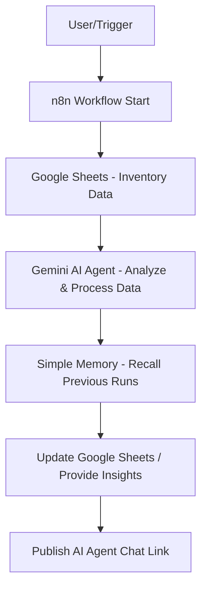

# 🌟 AI Agent for Automated Inventory Management

## 📌 Overview

I just built my **first AI Agent 🤖** to manage product inventory directly from my **Google Sheet** — powered by **n8n automation** and **Gemini API integration**.

This AI Agent demonstrates how businesses can **automate repetitive workflows** while ensuring accuracy and efficiency in inventory management.

---

## 📊 Features

* ✅ **Tracks & updates product availability** in real-time
* ✅ **Automates inventory checks** (no more manual work)
* ✅ **Reduces errors** caused by human input
* ✅ **Provides AI-powered insights** for smarter decision-making

---

## ⚡ Tech Stack Used

* 🔹 **n8n** → Workflow automation engine
* 🔹 **Gemini API** → AI intelligence for reasoning & insights
* 🔹 **Google Sheets** → Inventory data source

---

## 🚀 Why This Matters

This project is the **first step** in my journey of creating **agentic AI systems** that simplify everyday business workflows.

💡 **Imagine:**

* AI agents managing **sales, inventory, CRM, and reporting**
* Teams focusing on **strategic decisions** instead of repetitive tasks

---

## 🛠️ Step-by-Step Setup

### 1. 🔑 Get Gemini API Key

* Go to [Google AI Studio](https://aistudio.google.com/)
* Create a **new project**
* Generate your **Gemini API key**

### 2. ⚡ Set Up n8n

* Install n8n locally or use [n8n Cloud](https://n8n.io)
* Log in and start a **new workflow**

### 3. 🎬 Add Workflow Trigger

* Use **manual trigger** (for testing) or
* Use a **schedule trigger** (e.g., check inventory every 1 hour)

### 4. 🧠 Add AI Agent Node

* Select **AI Agent** node
* Paste your **Gemini API key**
* Configure it to **analyze inventory data** and provide insights

### 5. 📑 Connect Google Sheets

* Add the **Google Sheets node**
* Link it with your **product inventory sheet**
* Configure actions: **read / update stock levels**

### 6. 💾 Add Memory (Optional)

* Use **Simple Memory node** so the AI can **recall previous checks & insights**

### 7. 🧪 Test the Workflow

* Run the workflow
* Check if product stock levels are updated and insights are generated

### 8. 🌍 Make It Public

* Enable the **chat interface** in n8n
* Publish the bot and share the link with others

---

## 🔄 Workflow Diagram

---

## 🔮 Next Steps

* Expand agent capabilities to handle **multi-step business workflows**
* Connect with **CRM & Sales dashboards**
* Enable **real-time alerts** for stockouts and reorder points

---

## 🏷️ Tags

`#AI` `#Automation` `#n8n` `#GeminiAPI` `#GoogleSheets` `#AIagents`

---
